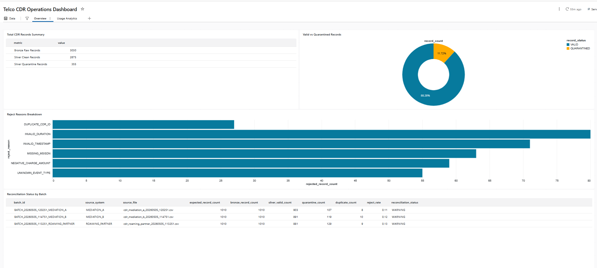
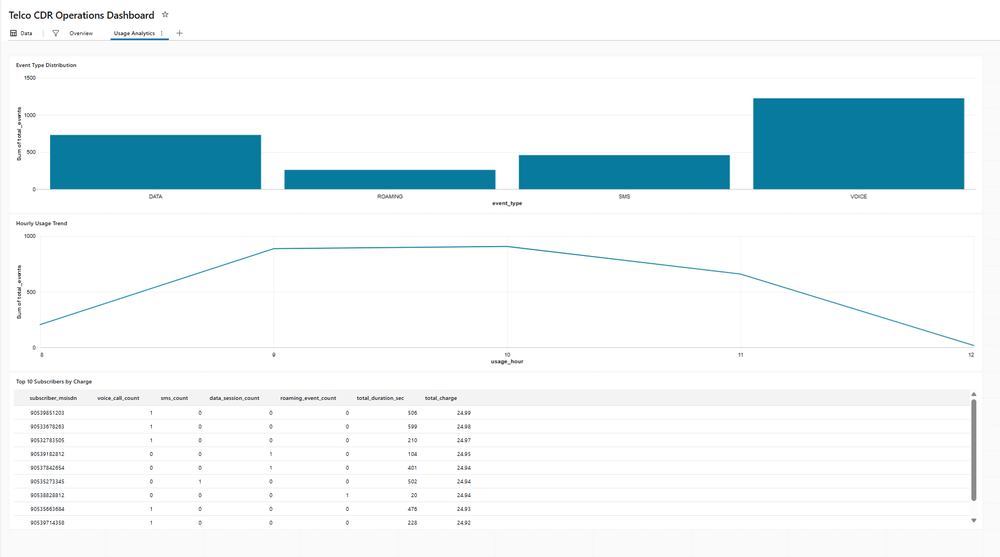

# Telco CDR Lakehouse Modernization

A Databricks Lakehouse project that simulates telecom CDR ingestion, validation, quarantine handling, reconciliation, and analytics using a Bronze-Silver-Gold architecture.

## Project Overview

Telecommunication companies process large volumes of Call Detail Records (CDR) generated by network, mediation, roaming, billing, and data session systems.

In many legacy data warehouse environments, CDR files are ingested by traditional ETL tools and loaded into relational databases such as Oracle. Business logic, reconciliation, and reporting are then often handled by SQL or PL/SQL packages.

This project demonstrates how a similar CDR processing flow can be redesigned using a modern lakehouse architecture on Databricks.

The goal is not to build a production-scale telecom platform, but to simulate the core data engineering patterns behind such a modernization:

- File-based CDR ingestion simulation
- Bronze, Silver, and Gold data layers
- Batch-level metadata tracking
- Data quality checks
- Quarantine handling for invalid records
- Duplicate detection
- Reconciliation reporting
- SQL analytics and dashboard-ready outputs

## Business Scenario

A telecom operator receives CDR data from multiple source systems:

- Mediation systems
- Network switch systems
- Roaming partners
- Data session platforms

Each source sends usage records in file batches. These records may contain data quality issues such as invalid timestamps, negative durations, missing subscriber identifiers, duplicate CDR IDs, or unknown event types.

The platform must ingest these records, preserve raw data, validate and standardize the records, isolate invalid records, and produce analytics-ready datasets for reporting and reconciliation.

## Legacy vs Modernized Architecture

### Legacy Pattern

```text
CDR Files
    -> Legacy ETL Tool
        -> Oracle Tables
            -> PL/SQL Packages
                -> Reconciliation / Reporting
```

### Modern Lakehouse Pattern

```text
Simulated CDR Batches
    -> Bronze Raw Layer
        -> Silver Validated Layer
            -> Gold Aggregates / Reconciliation
                -> SQL Analytics / Dashboard
```

## Target Architecture

```text
[Telco Source Systems]
    |
    |-- MEDIATION_A
    |-- MEDIATION_B
    |-- ROAMING_PARTNER
    |
    v
[Batch / File Simulation]
    |
    v
[Metadata Ingestion Log]
    |
    v
[Bronze Layer: Raw CDR Records]
    |
    +----------------------------+
    |                            |
    v                            v
[Silver Clean Layer]       [Quarantine Layer]
    |
    v
[Gold Layer]
    |-- Hourly Usage Summary
    |-- Subscriber Daily Usage
    |-- Daily Reconciliation
    |
    v
[Databricks SQL Analytics]
```

## Data Layers

### Bronze Layer

The Bronze layer stores raw CDR records with minimal transformation.

Main goals:

- Preserve raw records
- Track source system and source file
- Add ingestion timestamp
- Enable replay and auditability

Table:

```text
bronze_cdr_raw
```

### Silver Layer

The Silver layer stores validated, standardized, and deduplicated CDR records.

Main goals:

- Parse timestamps
- Cast numeric fields
- Validate business rules
- Detect duplicates
- Separate invalid records into quarantine

Tables:

```text
silver_cdr_clean
silver_cdr_quarantine
```

### Gold Layer

The Gold layer stores analytics-ready outputs.

Main goals:

- Hourly usage reporting
- Subscriber-level daily usage
- Batch-level reconciliation

Tables:

```text
gold_cdr_usage_hourly
gold_subscriber_usage_daily
gold_reconciliation_daily
```

## Key Features

- Bronze / Silver / Gold Lakehouse architecture
- Simulated file-based batch ingestion
- Batch-level metadata tracking
- Data quality validation
- Quarantine handling
- Duplicate detection
- Reconciliation checks
- SQL analytics layer
- Dashboard-ready tables

## Data Quality Rules

The project applies the following quality checks:

| Rule | Description | Reject Reason |
|---|---|---|
| Timestamp validation | Event timestamp must be parseable | `INVALID_TIMESTAMP` |
| Duration validation | Duration must be positive | `INVALID_DURATION` |
| Event type validation | Event type must be known | `UNKNOWN_EVENT_TYPE` |
| MSISDN validation | Subscriber MSISDN must not be null | `MISSING_MSISDN` |
| Charge validation | Charge amount must not be negative | `NEGATIVE_CHARGE_AMOUNT` |
| Duplicate detection | CDR ID must be unique per source system | `DUPLICATE_CDR_ID` |

## Reconciliation Logic

For each simulated batch, the pipeline compares source, processed, and rejected record counts.

Basic reconciliation formula:

```text
bronze_record_count = silver_valid_count + quarantine_count
```

Possible reconciliation statuses:

```text
RECONCILED
WARNING
FAILED
```

## Documentation

Detailed project documentation is available under the `docs/` and `architecture/` folders:

- [Project Scope](docs/project_scope.md)
- [Data Quality Rules](docs/data_quality_rules.md)
- [Reconciliation Logic](docs/reconciliation_logic.md)
- [Free Edition Notes](docs/free_edition_notes.md)
- [Data Model](architecture/data_model.md)
- [Target Architecture](architecture/target_architecture.md)
- [Pipeline Flow](architecture/pipeline_flow.md)

## Databricks Free Edition Note

This project was developed on Databricks Free Edition for learning and prototyping purposes.

Because public DBFS root and external storage integration are limited in this environment, the file landing layer is simulated using generated CDR batches and managed tables.

In a production implementation, the landing layer would typically be implemented on cloud object storage such as:

- Google Cloud Storage
- Amazon S3
- Azure Data Lake Storage

The same lakehouse processing pattern can then be extended to real file ingestion using cloud storage and production-grade orchestration.

## Repository Structure

```text
telco-cdr-lakehouse-modernization/
│
├── README.md
│
├── docs/
│   ├── project_scope.md
│   ├── data_quality_rules.md
│   ├── reconciliation_logic.md
│   └── free_edition_notes.md
│
├── architecture/
│   ├── target_architecture.md
│   ├── data_model.md
│   └── pipeline_flow.md
│
├── notebooks/
│   ├── 01_generate_cdr_batches.py
│   ├── 03_silver_quality_transform.py
│   ├── 04_gold_aggregations.py
│   ├── 05_reconciliation.py
│   └── 06_dashboard_queries.sql
│
├── sql/
│   ├── dashboard_queries.sql
│   ├── reconciliation_checks.sql
│   └── data_quality_summary.sql
│
├── sample_outputs/
│   ├── dashboard_overview.png
│   └── dashboard_usage_analytics.png
│
└── diagrams/
    └── mermaid_architecture.md
```

## How to Run

This project was developed on Databricks Free Edition.

Recommended execution order:

1. Run `01_generate_cdr_batches`
2. Run `03_silver_quality_transform`
3. Run `04_gold_aggregations`
4. Run `05_reconciliation`
5. Use the SQL queries under `sql/dashboard_queries.sql` to create Databricks SQL dashboard visualizations

Expected output tables:

| Layer | Table |
|---|---|
| Metadata | `metadata_ingestion_log` |
| Bronze | `bronze_cdr_raw` |
| Silver | `silver_cdr_clean` |
| Silver | `silver_cdr_quarantine` |
| Gold | `gold_cdr_usage_hourly` |
| Gold | `gold_subscriber_usage_daily` |
| Gold | `gold_reconciliation_daily` |

## Dashboard Preview

### Overview Page

This page shows pipeline-level data quality and reconciliation metrics.



### Usage Analytics Page

This page shows telecom usage analytics based on curated Gold tables.



## Planned Dashboard Metrics

The Databricks SQL dashboard includes:

- Total CDR events
- Valid vs quarantined records
- Event type distribution
- Hourly usage trend
- Top subscribers by charge
- Reconciliation status by batch
- Reject reasons breakdown

## Project Outputs

The project produces the following outputs:

- Raw CDR records in the Bronze layer
- Validated and standardized records in the Silver layer
- Rejected records with reject reasons in the Quarantine layer
- Hourly usage analytics
- Subscriber-level daily usage analytics
- Batch-level reconciliation results
- Databricks SQL dashboard visualizations

## Tech Stack

- Databricks Free Edition
- PySpark
- Spark SQL
- Delta-style managed tables
- Databricks SQL
- GitHub for project documentation

## Limitations

This project was built on Databricks Free Edition for learning and portfolio purposes.

Current limitations:

- Source file ingestion is simulated
- External cloud storage integration is not implemented
- Data volume is intentionally small
- Production IAM and governance are not configured
- Scheduling and alerting are not implemented in the first version

## Future Improvements

Possible next steps:

- Replace simulated batches with real cloud object storage ingestion
- Add Databricks Auto Loader
- Add workflow orchestration with Databricks Jobs
- Add source control total validation
- Add SLA-based late batch detection
- Add data quality alerts
- Add CI/CD deployment process
- Extend dashboard with historical trends
- Add BigQuery or Oracle serving layer integration

## Project Status

Current phase:

```text
Portfolio-ready mini PoC completed
```

Completed phases:

```text
Phase 1 - Data Generation & Batch Simulation
Phase 2 - Bronze Layer
Phase 3 - Silver Quality Transformation
Phase 4 - Gold Aggregations
Phase 5 - Reconciliation
Phase 6 - SQL Dashboard
Phase 7 - GitHub / LinkedIn Packaging
```

Note
No local Python environment is required.
The code is designed to run in Databricks notebooks.

## Author

Kamil Gün  
Senior Data Engineer | Oracle ODI | PL/SQL | ETL | SQL Tuning | Transitioning to Cloud & Lakehouse Data Engineering
